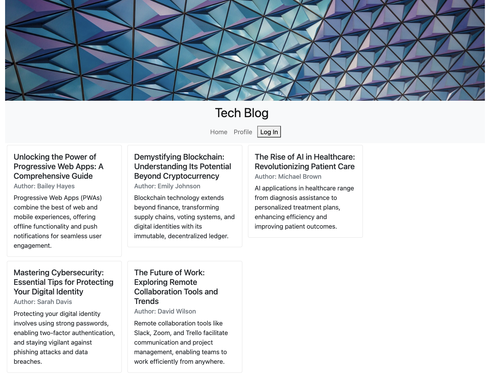

# Tech-Blog
  

  

## Description 
    Tech Blog is a web application built with Node.js, Express.js, Sequelize ORM, and MySQL. It provides users with the ability to create accounts, write blog posts, leave comments, and engage with other users' content. The application follows a MVC (Model-View-Controller) architecture for efficient code organization and maintenance.
## Table of Contents
- [Installation](#installation)
- [Usage](#usage)
- [License](#license)
- [Questions](#questions)
## Installation
    After cloning the repo, run npm i in the terminal in order to install all the necessary packages
## Usage
    1. Clone the Repo 
    2. Run npm i 
    3. Set up the database by running the db directory in your mysql shell 
    4. Seed the database by running the seed.js file within the seed directory. 
    5. Start the application by runing npm run start
## License
The license for this project is MIT
https://opensource.org/license/mit/

## Questions
  Contact me at benita.isaac@gmail.com if you have any other questions. Github: 
[https://github.com/benitaisaac](https://github.com/benitaisaac)
    